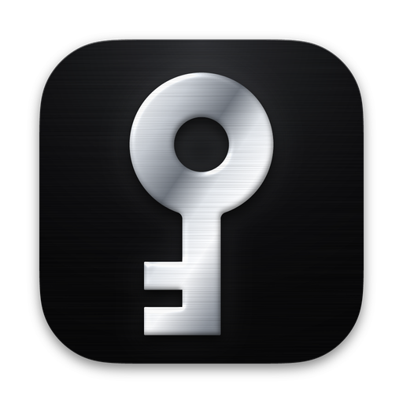

# Key Core 品牌图标（D1j）

本目录存放应用图标的母版、各平台导出物和生成脚本。Flutter **不会**打包本目录（`pubspec.yaml` 只声明了 `assets/icons/` 等目录，不含子目录 `assets/branding/`）。



## 设计
- **画面**：黑色拉丝石板底，带细颗粒和顶光；钥匙竖放，石墨银拉丝金属质感，有倒角高光、内阴影和投影。
- **几何**：所有尺寸都由杆宽 W 和黄金比 φ ≈ 1.618 推导，详见 [构造图](previews/d1j_construction.png)。

| 部位 | 公式 | 数值 |
|---|---|---|
| 钥匙环外径 | D = φ^2.75·W | 3.756 W（约占 824 圆角方形宽度的 44%） |
| 孔径 | d = D/φ² | 1.435 W |
| 总长 | L = φ⁴·W | 6.854 W |
| 钥匙环以下的杆长 | S = L − D | 3.098 W |
| 光杆 / 齿区 | S/φ² / S/φ（黄金分割） | 1.183 W / 1.915 W |
| 齿宽 / 间距 | t = S/φ³ / g = S/φ⁴（t : g = φ : 1，2t + g = S/φ） | 0.731 W / 0.452 W |
| 齿伸出 | h = W | 1 W |

- **macOS 版**：1024 画布，824 连续圆角方形，四边留白 100，带投影。
- **Windows / Linux 版**：944 圆角方形，不带投影。
- **小尺寸**：16 和 32px 的应用图标、全部托盘图标都做了像素对齐，杆和齿的直边落在整像素上，钥匙环和孔保持真圆。

## 文件
| 平台 | 文件 | 说明 |
|---|---|---|
| macOS | `macos/Runner/Assets.xcassets/AppIcon.appiconset/app_icon_{16..1024}.png` | 已接入工程，16 和 32 为像素对齐版 |
| macOS | `macos/Runner/Assets.xcassets/StatusBarIcon.imageset/`（18 / 36px，template） | 已接入，`AppDelegate.swift` 优先使用 |
| macOS | `branding/macos/AppIcon.icns` | 11 帧 PNG 图标，可作 DMG `--volicon` 用 |
| Windows | `branding/windows/app_icon.ico` | 16/20/24/32/40/48/64/96/128/256。生成 `windows/` 平台目录后，复制到 `windows/runner/resources/app_icon.ico` |
| Windows | `branding/windows/tray_icon_{white,black}.ico` | 16–48 托盘图标；白色版已作为 `assets/icons/app_icon.ico` 接入 |
| Linux | `branding/linux/hicolor/{16..512}x{N}/apps/key-core.png`、`scalable/apps/key-core.svg`、`key-core.desktop` | 安装到 `/usr/share/icons/hicolor/` 和 `/usr/share/applications/` |
| Linux 托盘 | `assets/icons/app_icon.png`（64px，白色） | 已接入；黑色和其他尺寸见 `branding/tray/` |
| 托盘 PNG | `branding/tray/tray_{white,black}_{16,18,22,24,32,36,44,64}.png` | 像素对齐 |
| 应用内 | `assets/icons/icon.png`（1224）、`assets/images/app_about.png`（256） | 已替换 |
| 母版 | `branding/source/*.svg` | macOS 版、方形版、小尺寸版、托盘版和构造图 |

预览图：[D1j 预览](previews/d1j_preview.png) · [钥匙环尺寸对比](previews/compare_bow_sizes.png) · [全部导出物](previews/contact_sheet.png)

## 重新生成
依赖：Python 3、`pip install pillow shapely`、`resvg`（Debian/Ubuntu 用 `apt install resvg`）。

```bash
cd assets/branding
python3 scripts/build.py D1j            # 生成 concept_D1j_src/*.svg（矢量母版）
python3 scripts/snap_k.py D1j           # 生成 concept_D1j_src/px/（像素对齐的小尺寸）
python3 scripts/export.py out           # 全部平台导出到 out/（与本目录内容逐字节一致）
python3 scripts/contact.py out out/contact_sheet.png
python3 scripts/construction_k.py D1j   # 构造图
```
`concept_*_src/` 和 `out/` 已加入 `.gitignore`。
